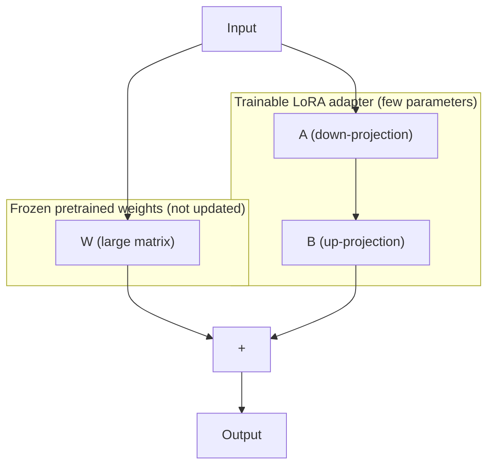

# Episode 2 — Parameter-Efficient Fine-Tuning (PEFT) with LoRA

Part of the *Building LLM & Agentic AI Applications* short course. This notebook walks through fine-tuning a small open-source LLM using **LoRA (Low-Rank Adaptation)** for a real-world, narrow task: banking customer-support **intent classification**.

## What this project does

Given a customer message such as:

> "I still haven't received the money someone sent me"

the model is trained to output the correct intent label, e.g. `transfer_not_received_by_recipient`.

The notebook:

1. Loads a small instruction-tuned LLM (`Qwen/Qwen2.5-0.5B-Instruct`).
2. Loads a focused subset of the [BANKING77](https://huggingface.co/datasets/PolyAI/banking77) dataset (6 intents, 40 train / 10 test examples per class).
3. Evaluates the **base model** on the task as a baseline (it struggles, as expected).
4. Fine-tunes the model with a **LoRA adapter** on the attention projection layers (`q_proj`, `k_proj`, `v_proj`, `o_proj`) using `trl`'s `SFTTrainer`.
5. Evaluates the **fine-tuned model** and compares it against the baseline (accuracy, precision, recall, F1, confusion matrices).
6. Discusses when fine-tuning is the right tool versus prompt engineering or RAG.

## Task & data

- **Dataset**: BANKING77, filtered down to 6 intents: `card_arrival`, `exchange_rate`, `lost_or_stolen_card`, `transfer_not_received_by_recipient`, `balance_not_updated_after_bank_transfer`, `activate_my_card`.
- **Size**: 240 training examples / 60 test examples (kept small intentionally for a fast, live-codeable demo).
- **Input**: free-text customer message. **Output**: one of the 6 intent strings.

## Model & method

- **Base model**: [Qwen2.5-0.5B-Instruct](https://huggingface.co/Qwen/Qwen2.5-0.5B-Instruct) — small enough to fine-tune on a single consumer GPU (e.g. RTX 3060 or a Colab T4), already instruction-tuned for chat-style prompts.
- **Fine-tuning technique**: LoRA (`r=16`, `lora_alpha=32`, `lora_dropout=0.05`), targeting the attention projections only, trained with `SFTTrainer` for 3 epochs (effective batch size 8, `bf16` on GPU).
- Loss is computed on the completion tokens only (`completion_only_loss=True`), so the model only learns to produce the intent label, not to reproduce the prompt.

## Requirements

- Python 3.10+
- A CUDA-capable GPU is strongly recommended for training (the notebook also runs on CPU for inference, but training will be very slow). It was designed for hardware such as a Colab T4 or an RTX 3060.
- See `requirements.txt` for the exact Python packages.

> Note: the notebook was built for a Colab environment and pins `torch`/`torchvision`/`torchaudio` to CUDA 12.8 wheels from `https://download.pytorch.org/whl/cu128`. If you're running locally, install the PyTorch build that matches your CUDA version (or the CPU build) from [pytorch.org](https://pytorch.org/get-started/locally/) instead of the pinned versions in `requirements.txt`.

## Setup

```bash
python -m venv .venv
source .venv/bin/activate  # on Windows: .venv\Scripts\activate
pip install -r requirements.txt
```

Then open and run `episode2_peft_lora_fixed.ipynb` top to bottom in Jupyter or Colab.

## Project structure

```
.
├── episode2_peft_lora_fixed.ipynb   # Main notebook: data prep, training, evaluation
├── requirements.txt                 # Python dependencies
└── README.md
```

## Outputs

Running the notebook produces:
- A trained LoRA adapter saved to `./qwen-banking-intent-lora`.
- A comparison table and bar chart of base-model vs. fine-tuned-model metrics (accuracy, precision, recall, F1, invalid-output rate).
- Confusion matrices for both models on the test set.
- A side-by-side table of individual predictions where the two models disagree.

## Results

Results below are from an actual run of the notebook (Qwen2.5-0.5B-Instruct, 3 LoRA epochs, 240 train / 60 test examples).

### LoRA architecture



### Base vs. fine-tuned metrics

| Metric | Base model | Fine-tuned model |
|---|---|---|
| Accuracy | 70.00% | 83.33% |
| Precision (macro) | 0.713 | 0.736 |
| Recall (macro) | 0.600 | 0.714 |
| F1 (macro) | 0.597 | 0.722 |
| Invalid-output rate | 0.00% | 1.67% |


### Confusion matrices

Fine-tuning tightens the diagonal noticeably compared to the base model, which frequently produces near-miss or malformed labels.


### Sample predictions after fine-tuning

| Input | Prediction | Ground truth |
|---|---|---|
| "What is my foreign exchange rate?" | `exchange_rate` | `exchange_rate` ✅ |
| "I'm waiting for my transaction to go through." | `transfer_not_received_by_recipient` | `transfer_not_received_by_recipient` ✅ |
| "Help me please! My card was stolen!" | `lost_or_stolen_card` | `lost_or_stolen_card` ✅ |
| "How long will it take to activate my new card?" | `activate_my_card` | `activate_my_card` ✅ |
| "Why doesn't it show that I did a balance transfer?" | `balance_not_updated_after_bank_transfer` | `balance_not_updated_after_bank_transfer` ✅ |
| "Is there tracking info available?" | `track_info` | `card_arrival` ❌ |

### Takeaway

Fine-tuning with LoRA lifted accuracy from 70% to 83% and macro F1 from 0.60 to 0.72, while training well under 1% of the model's parameters in a few minutes on a single consumer GPU. The fine-tuned model also converges to the exact expected label vocabulary far more consistently than the base model, which tends to paraphrase or invent categories (as seen in the `track_info` miss above, itself a near-miss on the correct intent).

## When to use fine-tuning vs. prompt engineering vs. RAG

The notebook closes with a discussion of trade-offs: prompt engineering is best when the task can be fully expressed in instructions and the model already has the relevant knowledge; RAG is best when answers depend on external/changing knowledge; fine-tuning (via PEFT/LoRA) is best when you need a consistent output format or specialized behavior baked into the model itself, as demonstrated here with intent classification.
